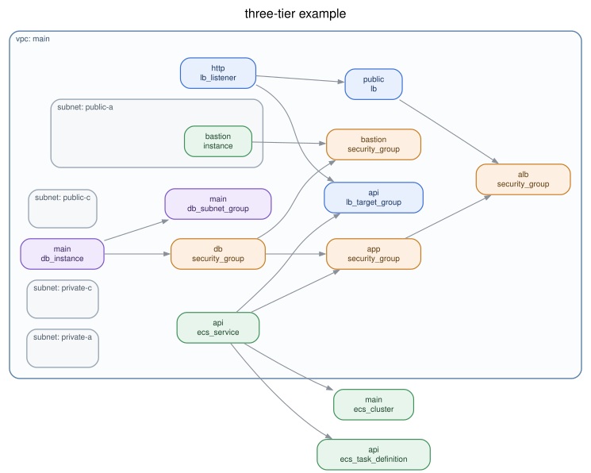

# oekaki

**Most diagram tools draw one kind of line. oekaki draws three, and the gaps between them are the answer.**

An architecture diagram usually shows what your Terraform declares. That tells
you how things are wired, but not what is *wrong*. The interesting questions are
comparisons:

| Edge kind | Comes from | Answers |
| --- | --- | --- |
| `iac_ref` | Terraform references | What breaks if I delete this? |
| `reachable` | Security groups, NACLs, routes | What *could* talk to what? |
| `observed` | Datadog, Prometheus | What actually does? |

Lay them over each other and the gaps light up. A path that is `reachable` but
never `observed` is a firewall rule nobody needs. A dependency that is
`observed` but has no `iac_ref` is a coupling nobody wrote down.

`observed` can arrive from an **overlay**, traces, metrics, or a log inventory:
small evidence documents that a person or an adapter writes down. `reachable`
is derived from supported network rules and is kept separate from observed
traffic; see [Status](#status).

The overlay is also the answer to a limitation worth stating plainly. **Code is
not the whole truth, and it is not automatically more true than what somebody
can see on a console.** A parser recovers what a file happens to record. An
overlay carries the rest — a connection nobody wrote down, a log stream from a
system nobody modelled, a rule someone removed by hand — and the graph records
which of the two said what.

---

## Try it

No AWS credentials, no `dot` binary, no cloud API calls. A checked-in example
runs immediately:

```console
$ go install github.com/imohiyoko/oekaki/cmd/oekaki@latest
$ git clone https://github.com/imohiyoko/oekaki && cd draw
$ oekaki render examples/three-tier/plan.json -o architecture.svg
```

<p align="center">
  
</p>

On your own infrastructure:

```console
$ terraform show -json tfplan > plan.json
$ oekaki render plan.json -o architecture.svg
```

`terraform show -json terraform.tfstate` works too, with a caveat noted under
[Plans and state](#plans-and-state).

## Why not one of the existing tools?

[InfraMap], [Rover] and [Terravision] are all good, and all answer the same
question: *what does my Terraform describe?* They render one kind of
relationship, because a Terraform file only contains one kind.

oekaki is aimed at a different question: *where does my infrastructure
disagree with itself?* That needs relationships Terraform does not contain,
which is why the edge kind is part of the data model rather than a rendering
detail, and why the schema — not the binary — is the thing this project is
really building.

Two consequences you can use today:

- **The graph is a file, not a picture.** `oekaki graph` emits JSON against
  a [published schema](schema/graph.schema.json). Query it, diff it, or write a
  parser for a provider nobody here has heard of.
- **Output is deterministic.** Same input, same bytes, layout included. You can
  commit the generated diagram and review it in a pull request, which is what
  makes the [GitHub Action](#keeping-a-diagram-in-your-repository) below
  worthwhile.

[InfraMap]: https://github.com/cycloidio/inframap
[Rover]: https://github.com/im2nguyen/rover
[Terravision]: https://github.com/patrickchugh/terravision

## Status

v0.5 prototype. The graph is intentionally a stable intermediate
representation so collectors, parsers, enrichers, and renderers can evolve
independently.

The stable surface is the **CLI and the graph JSON**. The Go packages are
exported so the parts can be read and tested separately, not as a library
contract: before v1.0 an exported signature can change in any release, and
this repository will not carry a compatibility shim for one.

- **Works:** Terraform and multi-language source parsing, `iac_ref`,
  `reachable`, and observed edges, observations with thresholds, log inventory
  polling/classification, trace and metrics adapters, exposure findings,
  architecture/network/ER/workflow/request-path/security/code/service and
  reachability views, plus interactive HTML drill-down.
- **LLM boundary:** `enrichers/ai.Generate` can pass a graph to an explicitly
  selected local executable and validates its `oekaki.ai-candidates`
  stdout before applying it. Candidates can add opaque nodes as well as
  relationships, each marked with AI provenance. No model, network client, or
  credential handling is built in.
- **Active evidence:** `oekaki probe` checks explicitly supplied targets
  from a named graph node and emits normalized reachability evidence. It
  describes the vantage point that ran the probe; it does not pretend to prove
  reachability from every replica.
- **Not yet:** provider-specific live discovery and `oekaki diff`. See
  [docs/roadmap.md].

### Providers

Five providers nest properly, on premises and in the cloud:

| Provider | Containers it understands |
| --- | --- |
| `aws` | VPC → subnet |
| `google` | network → subnetwork |
| `azurerm` | virtual network → subnet, plus resource groups on their own axis |
| `vsphere` | datacenter → cluster → resource pool |
| `kubernetes` | namespace |

**Anything else still renders** as a generic box — an unknown resource type is
never an error, and completeness across every provider resource is explicitly
not a goal. References are extracted the same way for every provider, including
ones nobody here has heard of, because they come from Terraform's own
expression graph rather than from a table.

Adding a provider is a new file under `providers/`; the parser and the
renderers do not change.

## Usage

```
oekaki render <input> [flags]     draw a diagram
oekaki graph  <input> [flags]     emit the intermediate representation
oekaki validate <graph.json>      check a graph against the IR schema
oekaki schema                     print the IR JSON Schema
```

`<input>` is `terraform show -json` output, a source directory, or a graph
oekaki produced earlier. `-` reads standard input.

A source directory is parsed conservatively into files, functions, packages,
and `contains`/`imports`/`calls` relationships across common Go, Python,
JavaScript/TypeScript, Java, Rust, Ruby, PHP, and C-family files. It emits the
same IR as Terraform, so all renderers and overlays remain reusable.
Unknown text extensions can also be represented as file nodes with
`--include-unknown-source`; language-specific parsers can register against the
same source parser API when richer AST information is available.

Views are graph projections rather than renderer-specific modes:

```console
$ oekaki render . -f html -o code.html --view workflow
$ oekaki render plan.json -f svg -o database.svg --view er
$ oekaki render graph.json -f svg -o path.svg --view request-path --root service:checkout --depth 4
$ oekaki render graph.json -f html -o exposure.html --view security-exposure
$ oekaki render . -f html -o checkout.html --view code-dependency --file services/checkout/main.go
$ oekaki render graph.json -f html -o reachable.html --view reachability --root service:checkout --depth 5
```

### Combining repositories

The graph input can be a repository directory, Terraform JSON document, or a
previous graph. Select several with repeatable `--repo` flags (or the
`--input` alias):

```console
$ oekaki graph --repo ../checkout --repo ../payments -o estate.json
$ oekaki render --repo ../checkout --repo ../payments \
    --view service-dependency -f html -o estate.html
```

When multiple inputs are selected, every entity is namespaced as
`repo-N-name:original-id`, and its `attrs.repository` identifies the source.
The graph metadata also records the selected local paths. This prevents two
repositories' `main` functions or Terraform addresses from being silently
merged while giving an AI adapter an explicit inventory of the context it saw.

An AI candidate document may return structured `needs` entries such as a
missing repository or library reference. The CLI prints each request and its
repository hint; the operator can clone or mount the requested source, add it
with another `--repo`, and regenerate the graph. oekaki does not clone or access
repositories by itself.

Static references are intentionally labelled by confidence: imports and
module dependencies are `library` references, while a recovered function call
is an `application` reference with a `static_*` resolution. Neither means that
the application actually executed the call. Use traces, logs, or metrics to
add `observed` evidence when runtime use matters; unresolved or ambiguous
static names are left for the AI `needs` loop instead of being guessed.

Domain-specific relationships use the open `relation` field (`calls`,
`reads`, `writes`, `imports`, `exposes`, and so on). The original `kind` field
remains for compatibility and evidence styling.

Collectors can append an `oekaki.observations` document through the
`enrichers/observations` package. Each observation carries a subject, metric,
value, unit, time/window, optional threshold, state, reason, and claim. This
keeps credentials and vendor APIs outside the deterministic graph/render path.
The `collectors/prometheus` package parses Prometheus text exposition into the
same observation format; the caller remains responsible for scraping and
authentication.
It also exposes `Scrape`, which accepts a caller-owned `http.Client`. The
`collectors/datadog` package accepts a caller-owned authenticated request and
converts Datadog point lists into the same format. The
`collectors/opensearch` package parses `_search` responses. No API key or
access token is stored in graph output.

`collectors/loginventory` provides the polling layer. Use `DirectoryStore` for
mounted S3/object-store replay, `ObjectStoreReader` for an SDK-backed S3/GCS
implementation, `SQLStore` for SQL tables, or `HTTPJSONStore` for an
OpenSearch/Calkey gateway that returns normalized records. Every backend
implements the same watermark-based `Fetch` contract, and the poller writes
only classified metadata to its inventory sink.

For a mounted log directory, the included poller can be run directly:

```console
$ go run ./cmd/logpoller --root ./mounted-logs --output log-inventory.json \
    --rule error='\bERROR\b' --interval 5m
$ oekaki render graph.json --log-inventory log-inventory.json \
    --view service-dependency -f html -o services.html
$ oekaki render graph.json --traces spans.json \
    --view request-path --root checkout -f html -o request.html
```

To record what a particular service can reach from its own runtime network,
run the probe from that network vantage point:

```console
$ oekaki probe graph.json --from service:checkout \
    --target service:auth=http://auth.internal/health \
    --target database:orders=db.internal:5432 \
    --protocol tcp -o checkout-reachability.json
$ oekaki render graph.json --reachability checkout-reachability.json \
    --view reachability --root service:checkout -f html -o checkout.html
```

An HTTP 4xx/5xx still proves that a connection reached the application; a
connection failure is recorded as a blocked path. Targets are always explicit,
and credentials, response bodies, and headers are not written to evidence.

Prometheus-compatible sensor values can be collected with the companion
poller. Labels are preserved, thresholds are attached to each sample, and the
JSON sink retains timestamped history for the diagram timeline:

```console
$ go run ./cmd/metricpoller --endpoint http://sensor:9090/metrics \
    --subject-label service --threshold 'error_rate=>:0.05' \
    --interval 1m --output observations.json
$ oekaki render graph.json --observations observations.json \
    --view service-dependency -f html -o sensor.html
```

Each input file contains one JSON record per line. The poller advances from a
watermark and writes only IDs, timestamps, labels, and derived characteristics;
raw log bodies are never written to the inventory.

An inventory can be joined back to a graph by applying an
`enrichers/loginventory.Enricher`. It first tries the stable graph ID, then a
unique node/group name or scalar identity attribute; ambiguous names are
reported and never guessed. The HTML detail panel then shows classified log
IDs, labels, timestamps, and characteristics without exposing the raw log
body.

### Where are my blind spots?

```console
$ oekaki graph plan.json --overlay overlay.json -o graph.json
overlay: 1 file, 8 assertions applied
  coverage: 1 blind, 1 silent, 1 undeclared, 1 flowing, 3 unknown  (window: last-7d)
  matched nothing (adopted): {service=reconciler}
  ambiguous, not applied: {name=main} -> aws_db_instance.main, aws_ecs_cluster.main
```

Every node gets one of five states: logs flowing, declared but silent, no
destination at all, arriving from something nothing declares, or **not
assessed**. The fifth is what makes the other four honest — painting an
unassessed resource as a blind spot is the same lie as painting a blind spot as
covered, so absence of evidence never renders as a finding.

Nothing disappears quietly. A subject that matches nothing becomes a node of its
own rather than being dropped, because a log stream that maps to nothing in your
infrastructure is the most valuable thing this map can produce. A subject that
matches several is applied to none of them and marks each `unknown`, because
ambiguity must not manufacture findings.

See [examples/log-coverage](examples/log-coverage/) — its overlay contains a
deliberately unmatched and a deliberately ambiguous assertion, so those paths
are exercised by CI on every commit.

**oekaki never silently calls a model.** A caller may explicitly run a
local model adapter through `enrichers/ai.Generate`, validate its candidate
document, and then apply it. The deterministic graph path only reads the
validated result.

### An interactive view

```console
$ oekaki render plan.json --overlay overlay.json -o coverage.html
```

One self-contained file — graph, layout engine, script and styles — that opens
straight from `file://` with no server. Fold containers, click a box for its
evidence and who claimed it, and filter by coverage state.

The page opens in **Read** mode. Switching to **Edit** turns on the gestures
that author a document: **shift-drag between two boxes to assert a connection**,
**Add box** for something that is in no input file, and a name field in the
detail panel to rename what a parser got right but labelled badly. Every one of
them is an assertion, exported as an overlay the CLI reads back — nothing is
written into the graph as though it had been found there. Read mode hides the
export controls, so a page being read never offers an artifact nobody authored.

Boxes can also be dragged in Edit mode, one at a time or several together —
drag the canvas to draw a box round them, or ⌘-click (Ctrl elsewhere) them one
at a time; dragging any of them moves all of them, and the header has controls
to line them up and even the gaps. Drag a box's edge to resize it; every box is
the same height until one is given another, because how much text a box holds
says nothing about how big the thing is. The right button (or ⌥-drag) moves the
view, because while editing the left one belongs to the drawing. Positions and
sizes are exported as
`oekaki.layout` and can be applied again with `--layout layout.json`; they
are relative to their parent container, so changes to the surrounding graph do
not invalidate every saved position. The generated graph is the master image;
layout and overlay files are the user image and carry human provenance.

The same document carries how the lines are drawn. A switch in the header
draws the whole diagram with curves or with right angles, and `--lines
orthogonal` makes that the shape a page is generated with, so a collection of
them does not have to be switched one page at a time. Clicking a line
offers the side of each box it leaves and arrives on — a side, not a point:
lines that meet the same side are spread along it, so a point chosen for one
would be wrong as soon as another arrived. A side left on **自動** is worked
out from where the two boxes ended up, and taking one back puts the line
straight back on the route the layout gave it.

Two caveats worth knowing before you use it. Every page is at least 1.5 MB,
because ELK is inlined. And the `.html` file is deterministic while the layout
inside it is computed in your browser — so **SVG is still the output to commit
into a pull request**.

### Serving a collection of them

One file that opens from `file://` is the right shape for one diagram on one
machine. It is the wrong shape for fifty behind a web server: the runtime is
1.5 MB and identical every time, while the graph document is a few tens of
kilobytes. `--external-assets` inverts that — the page loads a shared runtime
and fetches its own graph, so the runtime is sent once and cached and each
further diagram costs only its data.

```console
$ oekaki render graph.json -f html --external-assets -o out/estate.html
$ ls out
estate.html  estate.graph.json  oekaki.elk.js  oekaki.app.js  oekaki.app.css
```

`--asset-base` says where the shared files are served from, so many diagrams
can share one copy:

```console
$ oekaki render graph.json -f html --external-assets \
    --asset-base /shell/v1 -o site/runs/abc123/estate.html
```

The page asks for those files by a URL carrying the runtime's own fingerprint
(`oekaki.app.js?v=…`), so upgrading the binary and regenerating cannot
leave a reader running the old runtime against the new markup. Nothing has to
be renamed by hand: the same runtime keeps the same URL and stays shared, and
a different one gets a different URL and cannot be served from the old cache
entry. This matters more than it looks — a reload does not clear it, because
the bootstrap fetches the viewer by creating a script element rather than the
document declaring it.

A base with a scheme or an absolute path is treated as something a server
already exposes, and the runtime is not written locally — only the page and
its graph are. Note that such a page needs HTTP: a `fetch` from `file://` is
blocked as a cross-origin request, so the self-contained default remains the
one to open from a directory.

Useful flags for `render`:

| Flag | Effect |
| --- | --- |
| `-o FILE` | Write to a file; the extension picks the format |
| `-f FORMAT` | `svg`, `html`, `dot`, `mermaid` or `json` |
| `--overlay FILE` | Apply assertions; repeatable, `-` reads standard input |
| `--layout FILE` | Apply human-authored positions in HTML output |
| `--overlay-unmatched` | `adopt` (default), `report` or `error` |
| `--view NAME` | Project the graph as `architecture`, `network`, `er`, `workflow`, `request-path`, `security-exposure`, `code-dependency`, `service-dependency` or `reachability` |
| `--root ID` | Root node for request-path or reachability traversal |
| `--file PATH` | Focus a source file and its related entities |
| `--depth N` | Maximum traversal depth for focused views |
| `--observations FILE` | Apply thresholded metrics/health observations; repeatable |
| `--exposure FILE` | Apply an external exposure report; repeatable |
| `--reachable` | Derive reachability from supported network rules |
| `--reachability FILE` | Apply normalized effective paths from a network-policy/NACL/proxy collector; repeatable |
| `--log-inventory FILE` | Join classified log metadata; repeatable |
| `--traces FILE` | Join request traces and observed service paths; repeatable |
| `--ai-candidates FILE` | Apply validated model-produced nodes and relationship candidates; repeatable |
| `--ai-command FILE` | Explicitly run a local model adapter with the graph on stdin |
| `--ai-arg VALUE` | Pass one argument to `--ai-command`; repeatable, without shell expansion |
| `--icon-dir DIR` | Use your own licensed icons in HTML output; see [`icons/README.md`](icons/README.md) |
| `--external-assets` | HTML: load a shared runtime and fetch the graph, instead of one self-contained file. Needs `-o` and a server |
| `--asset-base URL` | Where that shared runtime is served from, e.g. `/shell/v1`; empty writes it beside the page |
| `--source-dir DIR` | Record which `.tf` file and line declared each resource |
| `--include-unknown-source` | Include text files whose extensions are not built in |
| `--kind KINDS` | Draw only some edge kinds, e.g. `--kind iac_ref` |
| `--axis AXIS` | Which grouping to nest by: `network`, `provider` or `module` |
| `--rankdir LR\|TB` | Layout direction |
| `--title TEXT` | Title above the diagram |
| `--legend` | Add a key for the edge kinds |
| `--fenced` | Wrap Mermaid output in a Markdown code fence |

Graphviz is compiled in as WebAssembly, so there is nothing to install and no
cgo. Only SVG is offered as an image: the WebAssembly raster backend mishandles
`fill="none"` and paints every edge as a solid blob, so PNG is left to a real
`dot` reading the `-f dot` output.

### Keeping a diagram in your repository

Because the output is deterministic, a diagram can live in your repo and be
regenerated by CI without producing noise on every run:

```yaml
- uses: imohiyoko/oekaki@v0.1.0
  with:
    plan: plan.json
    output: docs/architecture.svg
```

Or without the action, since Mermaid renders natively on GitHub:

```console
$ oekaki render plan.json -f mermaid --fenced > docs/architecture.md
```

### Reading the diagram

- **Boxes** are resources, coloured by category: network, compute, database,
  security, storage.
- **Rounded containers** are whatever holds things on the axis you chose: VPCs
  and subnets, vSphere datacenters and clusters, Kubernetes namespaces. They are
  drawn as containers rather than boxes, so a subnet never appears twice. An
  empty one still gets a border, because an empty subnet is worth noticing.
- **Arrows** point from a resource to what it depends on. `A → B` means deleting
  B breaks A.
- A resource that spans several subnets is drawn in the smallest container
  holding all of them, which is usually the VPC. A multi-AZ load balancer is not
  in one subnet, and pretending otherwise would be a lie.

## Plans and state

A **plan** carries a `configuration` block, so references are known exactly.
This is the input to prefer.

A **state** file does not. References are recovered by matching identifiers
found in attribute values, the way InfraMap does. It works well on applied
infrastructure, but it can only see dependencies that left a concrete
identifier behind, and it deliberately ignores tags and duplicated names to
avoid inventing edges that look plausible and are wrong.

## The graph format

The schema is the actual product. A parser in any language is a first-class
parser if its output validates:

```console
$ oekaki graph plan.json | oekaki validate -
ok: 13 nodes, 13 edges, 6 groups
```

The same estate can be grouped several ways at once — by network topology, by
provider, by module — because infrastructure has no single correct hierarchy.
Render any of them with `--axis`.

Nodes carry a `metrics` field that parsers must not touch — that space belongs
to enrichers, while time-scoped measurements live in `observations`. See
[docs/schema.md] for the full description and [docs/architecture.md] for how the
pieces fit together.

## Contributing

The most valuable contribution is a parser or renderer, because those are
supposed to be addable without touching the core. [CONTRIBUTING.md] describes
the boundaries. Adding a resource type is a few lines in one file under
`providers/`, and adding a whole provider is a new file there — neither
requires touching the parser or the renderers.

## License

Apache-2.0. See [LICENSE](LICENSE).

The binaries embed Graphviz, which is EPL-2.0. Every release archive carries
[THIRD_PARTY_NOTICES.md](THIRD_PARTY_NOTICES.md) with the full attribution.

[docs/roadmap.md]: docs/roadmap.md
[docs/schema.md]: docs/schema.md
[docs/architecture.md]: docs/architecture.md
[CONTRIBUTING.md]: CONTRIBUTING.md
