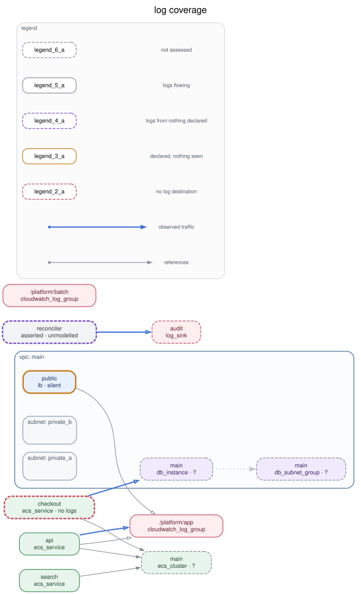

# log coverage

Where are logs being collected, and where are the blind spots?

```console
$ oekaki graph plan.json --overlay overlay.json --overlay-report report.json -o graph.json
$ oekaki render graph.json --title "log coverage" --legend -o coverage.svg
```

<p align="center">
  
</p>

Everything here is invented. No real service, index, account or host appears in
this directory.

## Where the answer comes from

Not from the Terraform. `plan.json` says what exists; it does not say what is
arriving in a log destination, and it cannot — that is not a fact a
configuration file contains.

So the coverage comes from `overlay.json`: a list of assertions somebody wrote
after looking at an operations console. oekaki never writes one. It
consumes overlays and never generates them, which is what lets a person or a
model supply this half without costing the tool its determinism — whatever
produced the file was free to be non-deterministic, and once the file exists
the same input still produces the same bytes.

## The five states

| State | Means | In this example |
| --- | --- | --- |
| **flowing** | Declared somewhere, and something was seen arriving | `aws_ecs_service.api` |
| **silent** | Declared, and nothing arrived | `aws_lb.public` — access logging is configured and the destination is empty |
| **blind** | Somebody looked and found no destination at all | `aws_ecs_service.checkout` |
| **undeclared** | Logs arrive from something nothing declares | `asserted:service=reconciler` |
| **unknown** | Nobody asserted anything, or what was asserted could not be told apart | the three resources named `main` |

Five rather than four, and the fifth is the one that makes the others honest.
Painting an unassessed resource as a blind spot is the same lie as painting a
blind spot as covered. **Absence of evidence never renders as a finding**: a
resource nobody mentioned gets no coverage at all, and `aws_ecs_service.search`
in this example is drawn exactly as it would be if none of this existed.

Note also that `aws_lb.public` is **silent, not flowing**, even though the
overlay contains an observation for it. The observation counted zero. Somebody
looked at an empty destination, which is the finding rather than its opposite.

## Two of these assertions are deliberately broken

That is the point of them.

**One subject matches nothing.** `{"service": "reconciler"}` answers to no
resource in the plan. By default it is *adopted* — drawn as its own box, dashed,
typed `oekaki_asserted` so it can never be mistaken for something the
parser found. Dropping it would have been tidier and wrong: a log stream that
maps to nothing in your infrastructure is the most valuable thing this map can
produce, because it means there is a system here that nobody has modelled.
`--overlay-unmatched=report` drops it and says so; `=error` refuses to finish.

**One subject is ambiguous.** `{"name": "main"}` matches four things. The
assertion is applied to none of them, and every candidate is marked `unknown`
with the reason attached. Skipping it quietly would have looked harmless and
would not have been: a candidate with no other evidence would have kept
whatever state it had, and could have been drawn as a blind spot that nobody
ever claimed. Ambiguity must not manufacture findings.

Both appear in `report.json`, which `make example` regenerates and CI diffs. If
a future change starts dropping evidence silently, that file moves and the
build fails.

## And one disagreement

The overlay asserts that the edge from `aws_db_instance.main` to
`aws_db_subnet_group.main` is not real. The parser found it in the
configuration. Both claims survive: the edge stays in the graph marked
`suppressed`, it is drawn faint and dotted rather than deleted, and the
disagreement is recorded in `conflicts` with each side's claimant.

A reader who cannot see the edge cannot judge the claim that it is not real.
`--hide-suppressed` is for a reader who has judged it already.

The `checkout → main` edge runs the other way: nothing in the configuration
says it exists, a model claims it does with a confidence of 0.6, and it is
drawn with a hollow arrowhead to say so.

## Regenerating

```console
$ make example
```

`plan.json` is built by `gen_plan.py` rather than captured from a real
`terraform show -json`, so nothing in this directory ever came off anybody's
account.
